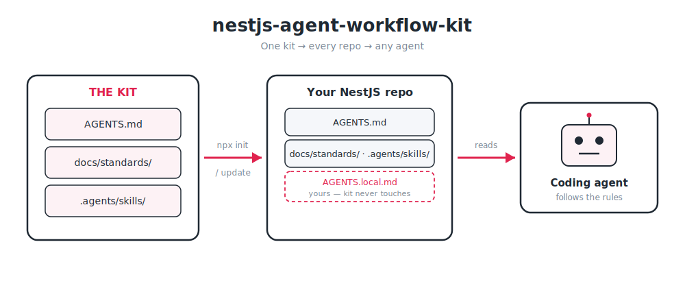
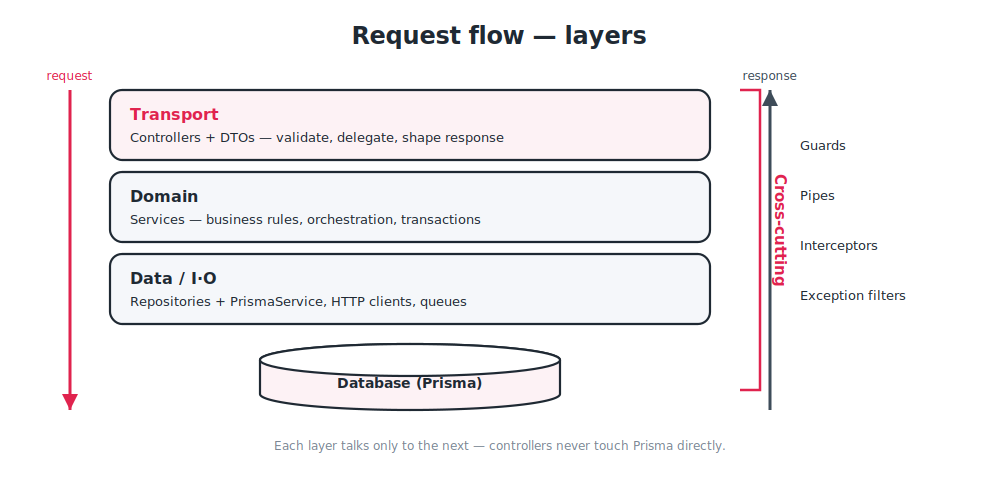
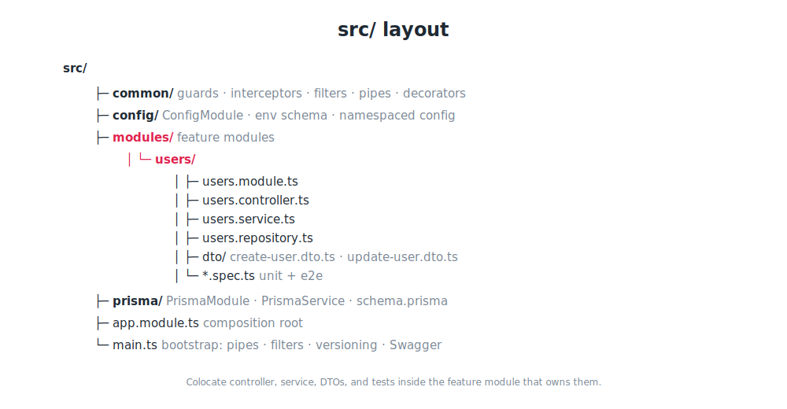

# nestjs-agent-workflow-kit

[](https://github.com/hamzaali81/nestjs-agent-workflow-kit/actions/workflows/ci.yml)
[](LICENSE)

Shared agent workflow for **[NestJS](https://nestjs.com)** projects: one entrypoint (`AGENTS.md`), engineering standards (`docs/standards/`), and task skills (`.agents/skills/`). Point any coding agent at `AGENTS.md` and it inherits the same rules and capabilities across every repo.

## How it works

The kit gives every project a single source of truth an agent can read:

- **`AGENTS.md`** is the entrypoint. It tells the agent where the rules and skills live.
- **`docs/standards/`** holds the engineering conventions (architecture, controllers, DTOs, providers, Prisma, testing, …) — the shared defaults for the stack.
- **`.agents/skills/`** holds task-triggered capabilities (code review, Prisma data layer, OpenAPI, new-app scaffolding) with deep references.
- **`AGENTS.local.md`** is yours alone — project-specific exceptions the kit never touches.

Run the CLI once to copy these into a repo, and `update` later to pull refreshed standards and skills.

## Diagrams

**Kit workflow** — standards and skills flow from the kit into your repo; the agent reads them (plus `AGENTS.local.md`).



**Request flow** — transport, domain, and data layers; cross-cutting guards, pipes, interceptors, and filters.



**`src/` layout** — feature modules under `modules/`, shared `common/`, `config/`, and `prisma/`.



## Layout

| Path              | Purpose                                                                          |
| ----------------- | -------------------------------------------------------------------------------- |
| `AGENTS.md`       | Agent entrypoint — where to look for rules and skills                            |
| `docs/standards/` | Implementation conventions (architecture, controllers, DTOs, providers, Prisma, …) |
| `.agents/skills/` | Task-triggered capabilities (code review, Prisma data layer, OpenAPI, …)          |
| `AGENTS.local.md` | **Your project only** — exceptions; not copied or overwritten by the kit         |

Code review lives in the **code-review** skill only, not in `docs/standards/`. Topic standards own audit rules; the skill orchestrates scope, routing, and report format.

## Install into a project

From GitHub (before npm publish):

```bash
npx github:hamzaali81/nestjs-agent-workflow-kit init
```

From npm (after publish):

```bash
npx nestjs-agent-workflow-kit init
```

Target another directory:

```bash
npx nestjs-agent-workflow-kit init ./path/to/my-nest-app
```

`init` skips files that already exist by default. Overwrite on install:

```bash
npx nestjs-agent-workflow-kit init --force
```

## Commands

| Command        | Description                                                             |
| -------------- | ----------------------------------------------------------------------- |
| `init [dir]`   | Copy `AGENTS.md`, `docs/standards/`, `.agents/skills/` into the project |
| `update [dir]` | Refresh managed files from the kit (overwrites by default)              |
| `list`         | Show kit version, managed paths, standards, and skills                  |
| `doctor [dir]` | Verify managed paths exist in the project                               |

```bash
npx nestjs-agent-workflow-kit update            # refresh standards + skills
npx nestjs-agent-workflow-kit update --no-force # only add missing files
npx nestjs-agent-workflow-kit list
npx nestjs-agent-workflow-kit doctor
```

CLI bins: `nestjs-agent-workflow-kit`, `nestjs-awkit`, `naw`. Add `--version` to print the kit version.

> **Note:** `update` **overwrites** managed files (`AGENTS.md`, `docs/standards/`, `.agents/skills/`) by default — that is how you receive refreshed standards. Do **not** hand-edit managed files; put project-specific rules in `AGENTS.local.md` (never touched by the kit). Use `update --no-force` to only add missing files.

## Local overrides

After `init`, add **`AGENTS.local.md`** at the project root for repo-specific rules (Nest/Prisma versions, forbidden patterns, links to internal docs). The kit never manages that file. `AGENTS.md` already points agents at standards, skills, and local overrides.

## Manifest

Managed paths are listed in `manifest.json` for predictable updates:

```json
{
  "version": "0.1.0",
  "managedPaths": [
    "AGENTS.md",
    "docs/standards",
    ".agents/skills"
  ]
}
```

## Publishing

1. Push to your Git host.
2. `npm publish --access public` (optional).
3. Consumers run `npx nestjs-agent-workflow-kit init` or `npx github:hamzaali81/nestjs-agent-workflow-kit init`.

## Developing the kit

```bash
node bin/install.mjs list
node bin/install.mjs doctor ..              # check a parent Nest app
node bin/install.mjs init /tmp/test-app --force
```

## Included skills

- `nestjs-developer` — core NestJS patterns and references (modules, DI, controllers, DTOs, config, errors, testing, CLI)
- `nestjs-new-app` — new Nest app scaffolding and bootstrap wiring
- `prisma-data-layer` — Prisma `PrismaService`, repositories, schema, transactions, error mapping
- `openapi-swagger` — OpenAPI docs with `@nestjs/swagger`
- `code-review` — convention review workflow (orchestrates `docs/standards`)

## Included standards

- `architecture.md`, `core-engineering.md`, `controllers.md`, `dtos-and-validation.md`
- `providers-and-services.md`, `modules.md`, `configuration.md`
- `database.md` (Prisma), `error-handling.md`, `testing.md`

## Stack assumptions

Standards and skills assume **NestJS + TypeScript (strict)**, **class-validator/class-transformer** DTOs, **Prisma** for the data layer, and **Jest + Supertest** for tests. Override anything project-specific in `AGENTS.local.md`.

## License

MIT
